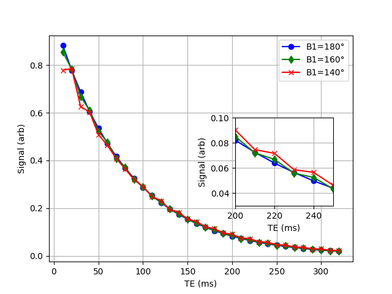

# Summary

Magnetic resonance imaging (MRI) is a common imaging technique to evaluate, assess, and diagnose diseases throughout the body. One of the most common MRI sequences is a T2 sequence which is sensitive to changes in the brain due to disease processes, for example multiple sclerosis (MS).  In MS, the disease breaks down the myelin surrounding the neurons [@Dobson2019-eh] resulting in disability for the patient. Myelin water imaging [@MacKay1994-aj] is one technique to quantify the myelin water in the brain to assess the degree of disease and is based on a multi-echo T2 decay curve. This T2 decay curve is fit and the short T2 component has been shown to be related to myelin.

# Statement of need

MRI sequences such as the multi-echo T2 are affected by minor scanner mis-calibration and hardware inhomogeneities. In particular, a multi-echo T2 acquisition will initially have a decreased signal due to hardware inhomogenities but then accumulate errant signal known as stimulated echoes.  This combination of decreased signal and increased stimulated echoes gives a T2 decay curve that can not be fit by traditional means. 

The `T2Stimulate` Python package models the decreased signal and stimulated echoes based on known parameters to create a T2 decay curve that incorporates all the information. As well, there is a Python function to fit a decay curve that is affected by such signal variation in order to determine the T2 components and the inhomogeneity in the B1 field. This software will be useful for any MRI researcher doing work with T2 decay curve fitting.

# Example

The example below is of a 32 echo decay curve "acquired" based on three different refocussing pulse flip angles.

```
import matplotlib.pyplot as plt
import numpy as np

from t2stimulate.simulate import stimulate

# Set a couple of parameters
num_echoes = 32
tau = 5
T1 = 1000

te = 2*tau*np.arange(1, num_echoes+1)

curve_140 = stimulate(alpha=140 / 180 * np.pi, num_echoes=num_echoes, T1=450, T2=80, tau=tau)
curve_160 = stimulate(alpha=160 / 180 * np.pi, num_echoes=num_echoes, T1=450, T2=80, tau=tau)
curve_180 = stimulate(alpha=180 / 180 * np.pi, num_echoes=num_echoes, T1=450, T2=80, tau=tau)

plt.figure(1)
plt.clf()

plt.plot(te, curve_180, 'bo-')
plt.plot(te, curve_160, 'gd-')
plt.plot(te, curve_140, 'rx-')
plt.xlabel('TE (ms)')
plt.ylabel('Signal (arb)')
plt.grid('on')

plt.legend(['B1=180°', 'B1=160°', 'B1=140°'])

plt.axes((0.6, 0.3, 0.25, 0.3))

plt.plot(te, curve_180, 'bo-')
plt.plot(te, curve_160, 'gd-')
plt.plot(te, curve_140, 'rx-')
plt.xlabel('TE (ms)')
plt.ylabel('Signal (arb)')
plt.grid('on')
plt.xlim((200,250))
plt.ylim((0.03, 0.1))

plt.show()
```




# References

